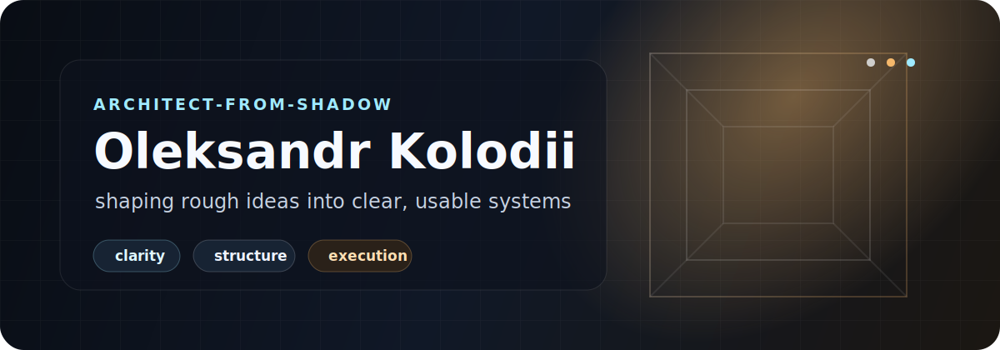

  

  
  
  
   
  
  
  
  

<h3 align="center">AI workflows, native apps, bots, databases, and automation with a product-first mindset.</h3>

  <strong>clean structure</strong> / useful interfaces / reliable systems / polished delivery

<table>
  <tr>
    <td width="58%">
      <h3>Build Surface</h3>
      

        <strong>I build practical digital systems</strong> across
        <code>AI workflows</code>, <code>Swift apps</code>, <code>Telegram bots</code>,
        <code>Windows utilities</code>, and <code>database-backed tools</code>.
      

      

        The goal is simple: turn unclear tasks into products that feel structured,
        usable, and finished.
      

    </td>
    <td width="42%">
      <h3>Current Direction</h3>
      <ul>
        <li><strong>AI systems</strong> and prompt-driven workflows</li>
        <li><strong>Swift</strong> development for iOS and macOS</li>
        <li><strong>Telegram</strong> bots, integrations, and automation flows</li>
        <li><strong>Windows</strong> tools, dashboards, and useful interfaces</li>
        <li><strong>Databases</strong>, storage, and product logic</li>
        <li><strong>Portfolio work</strong> that looks finished, not half-made</li>
      </ul>
    </td>
  </tr>
</table>

<h2 align="center">Skill Map</h2>

  the stack I use to move from idea to working product

<table>
  <tr>
    <td align="center" width="25%">
      <code>AI + Prompts</code> 
      workflow design, task decomposition, AI-assisted building
    </td>
    <td align="center" width="25%">
      <code>Swift + Apple</code> 
      iOS, macOS, app interfaces, native product work
    </td>
    <td align="center" width="25%">
      <code>Telegram</code> 
      bots, integrations, notifications, chat workflows
    </td>
    <td align="center" width="25%">
      <code>Windows</code> 
      desktop tools, setup flows, cross-platform thinking
    </td>
  </tr>
  <tr>
    <td align="center" width="25%">
      <code>Automation</code> 
      scripts, repeatable systems, process cleanup
    </td>
    <td align="center" width="25%">
      <code>Frontend</code> 
      interfaces, layout, responsive polish, UX flow
    </td>
    <td align="center" width="25%">
      <code>Databases</code> 
      schemas, storage, queries, product data models
    </td>
    <td align="center" width="25%">
      <code>Product</code> 
      ideas, positioning, feature thinking, launch shape
    </td>
  </tr>
</table>

  
   
  

<h2 align="center">How I Think</h2>

  clarity first, then execution, then polish

<table>
  <tr>
    <td align="center" width="33%">
      <code>01</code> 
      <strong>Find the structure</strong> 
      Before building, I try to understand what the thing really needs to become.
    </td>
    <td align="center" width="33%">
      <code>02</code> 
      <strong>Make it usable</strong> 
      Good work should be clear, practical, and easy to continue improving.
    </td>
    <td align="center" width="33%">
      <code>03</code> 
      <strong>Add the polish</strong> 
      The final 20% matters: naming, layout, flow, and the feeling of quality.
    </td>
  </tr>
</table>

 

  from shadow 
  <strong>into structure</strong>

