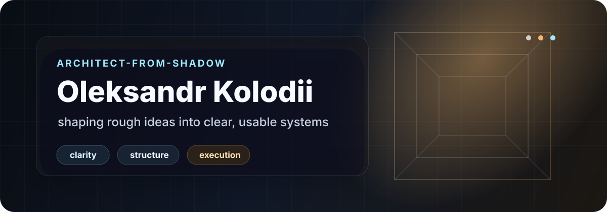

  

<h1 align="center">Oleksandr Kolodii</h1>

<b>Full-Stack Developer · Next.js, Supabase · AI Agents & Automation</b> 
Dublin, Ireland · Open to freelance work

  <a href="https://theory-academy.com">theory-academy.com</a> ·
  <a href="https://www.upwork.com/freelancers/~01a8da81399f0ee8a0">Upwork</a> ·
  <a href="https://shadow-os.com">shadow-os.com</a>

---

I build web products and AI automations that run in production. I take a project from an unclear idea to a deployed app: the UI, the database, payments, integrations and the launch.

## What I work on

- **Web apps and SaaS.** Next.js, React, TypeScript, Supabase / PostgreSQL, auth, Stripe subscriptions, Vercel
- **AI agents and automation.** OpenAI / Claude APIs, n8n, Python, scheduled agents, approval flows in Telegram
- **Bots and integrations.** Telegram bots, webhooks, REST APIs, email, Google Analytics
- **Native apps (in progress).** SwiftUI for iOS and macOS

## Projects

| Project | What it is | Stack |
|---|---|---|
| [Theory Academy](https://theory-academy.com) | Live driving theory test prep platform for Ireland. I designed, built and run it alone. | Next.js, TypeScript, Supabase, Stripe, Vercel |
| Autopilot | AI agents that handle parts of a business (analytics reports, content planning, support inbox) plus a control center to steer them | Python, TypeScript, LLM APIs, n8n, Telegram |
| Daybook Collector | Phone-first PWA that collects daily data for a food business | TypeScript, PWA |
| [Shadow](https://shadow-os.com) | Local-first personal assistant: agent-driven iOS app with a Swift server | SwiftUI, Swift / Hummingbird |

## How I work

1. **Understand first.** Questions, then a short plan with scope and price.
2. **Ship early.** A working demo as soon as possible, updates every 1–2 days.
3. **Leave it clean.** Readable code in your repo and short docs at the end.

## Stack

---

Need an MVP built, a Next.js app fixed, or a process automated with AI? <a href="https://www.upwork.com/freelancers/~01a8da81399f0ee8a0">Message me on Upwork</a>.

